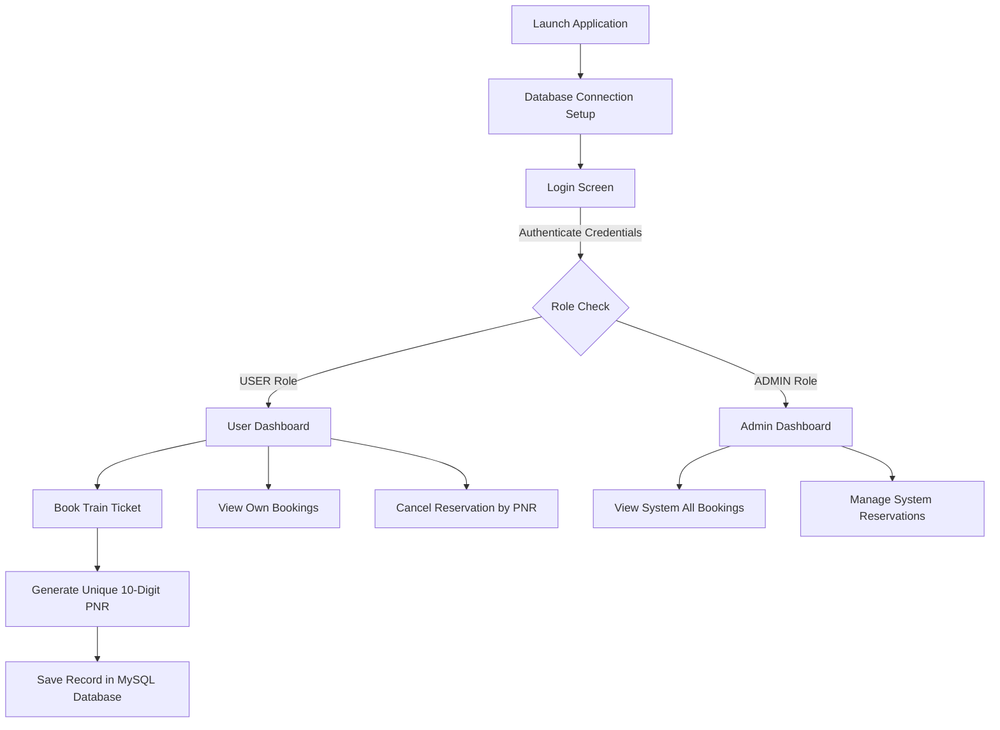

# Online Reservation System

A full-screen desktop train ticket booking, reservation management, and role-based administration system built with **Java 21**, **Java Swing**, **FlatLaf**, **JDBC**, and **MySQL**.

---

## 🎯 Objective

The objective of the **Online Reservation System** is to provide a seamless, secure, and modern desktop application for train ticket reservations. It replaces legacy command-line or outdated interfaces with an intuitive single-window GUI. The system simplifies train selection, ticket booking with auto-generated unique PNR numbers, reservation lookups, ticket cancellations, and role-based administration for passengers and system administrators.

---

## ✨ Features

- **🖥️ Modern Full-Screen Desktop UI**:
  - Built with FlatLaf dark look-and-feel.
  - Maximized full-screen single-window layout utilizing Swing's `CardLayout` (`setExtendedState(JFrame.MAXIMIZED_BOTH)`).
- **🗄️ Dynamic MySQL Database Integration**:
  - Live train schedule loading into `JComboBox<Train>` selection fields.
  - Automatic station route population (Source Station, Destination Station, Train Name).
  - Real-time dashboard statistics (`Active Trains`, `Total Bookings`, `Your Bookings`).
- **🔐 Role-Based Access Control (RBAC)**:
  - **`USER` Role**: View and search **only** their own reservations (`WHERE user_id = ?`). PNR lookups and cancellations are strictly verified at the database layer.
  - **`ADMIN` Role**: View, search, and manage all user reservations system-wide with candidate/passenger attribution.
- **🎫 Interactive Ticket Booking**:
  - Automated generation of unique 10-digit PNR numbers (`PNRGenerator`).
  - Confirmation modals displaying complete booking details.
  - Searchable `JTable` rendering active bookings with alternating row highlights and a **Refresh** button.
- **❌ PNR Cancellation & Validation**:
  - Secured cancellation panel requiring valid PNR input.
  - PNR ownership checks with confirmation prompts before database record deletion.
- **🛡️ Input Validation**:
  - Journey date validation using `java.time.LocalDate` / `DateTimeFormatter` (prevents selecting past dates).
  - Class of travel selection (`AC First Class`, `AC 2 Tier`, `AC 3 Tier`, `Sleeper`, `General`).
  - Source and destination inequality validation.

---

## 🛠️ Technologies Used

- **Programming Language**: Java 21 (LTS)
- **GUI Framework**: Java Swing
- **Look and Feel**: [FlatLaf](https://www.formdev.com/flatlaf/) 3.4.1 (FlatDarkLaf)
- **Database**: MySQL 8.0
- **Database Connectivity**: JDBC (`mysql-connector-j:8.3.0`)
- **Build & Dependency Management**: Apache Maven 3.8+
- **Testing Framework**: JUnit 5 (JUnit Jupiter 5.10.2)

---

## 🚀 How to Run

### Prerequisites
- **Java Development Kit (JDK)**: Version 21 or higher
- **MySQL Server**: Running locally on port `3306`
- **Apache Maven**: Version 3.8+

### 1. Database Setup
Make sure MySQL Server is running locally on port `3306`. Import the schema script to initialize the `online_reservation` database, tables, and sample data:

```bash
mysql -u root -p < database/schema.sql
```

### 2. Pre-Configured Test Accounts

| Username | Password | Role | Full Name |
|---|---|---|---|
| `admin` | `admin123` | `ADMIN` | System Administrator |
| `user` | `user123` | `USER` | Passenger User |
| `tanuj` | `tanuj123` | `USER` | Tanuj Pratap Singh |

### 3. Build and Run Application

#### Option A: Build Executable Package & Run JAR
```bash
mvn clean package
java -jar target/online-reservation-system-1.0.0-jar-with-dependencies.jar
```

#### Option B: Run via Maven Exec Plugin
```bash
mvn compile exec:java
```

#### Option C: Run Automated Test Suite
```bash
mvn test
```

---

## 📁 Project Structure

```text
Java-Task1-OnlineReservationSystem/
├── pom.xml
├── database/
│   ├── schema.sql                     # Database schema creation & initial test data
│   └── migration.sql                  # Database migration scripts
├── src/
│   ├── main/
│   │   └── java/
│   │       └── com/
│   │           └── oasis/
│   │               ├── Main.java                        # Application entry point
│   │               ├── config/
│   │               │   └── DatabaseConnection.java      # JDBC connection pool configuration
│   │               ├── dao/                             # Data Access Objects (SQL queries)
│   │               │   ├── UserDAO.java
│   │               │   ├── TrainDAO.java
│   │               │   └── ReservationDAO.java
│   │               ├── model/                           # Data models & POJOs
│   │               │   ├── User.java
│   │               │   ├── Train.java
│   │               │   └── Reservation.java
│   │               ├── service/                         # Core business logic services
│   │               │   ├── AuthenticationService.java
│   │               │   └── ReservationService.java
│   │               ├── ui/                              # Swing GUI Views & Panels
│   │               │   ├── LoginFrame.java
│   │               │   ├── MainFrame.java
│   │               │   ├── DashboardPanel.java
│   │               │   ├── ReservationPanel.java
│   │               │   ├── ViewReservationsPanel.java
│   │               │   └── CancellationPanel.java
│   │               └── util/                            # Helpers & PNR generators
│   │                   ├── PNRGenerator.java
│   │                   └── ValidationUtil.java
│   └── test/
│       └── java/
│           └── com/
│               └── oasis/
│                   └── ReservationSystemTest.java       # JUnit 5 integration & unit tests
└── target/
    └── online-reservation-system-1.0.0-jar-with-dependencies.jar
```

---

## 🖼️ Screenshots

*Below are representations of the core UI views designed with FlatLaf Dark Mode:*

1. **Login Screen**:
   - Modern centered login card with dark styling, user role detection, and credential validation.
   - `[ Screenshot Placeholder: docs/screenshots/login_screen.png ]`

2. **Dashboard Overview**:
   - Real-time statistics cards displaying `Active Trains`, `Total Bookings`, and `Your Bookings`.
   - `[ Screenshot Placeholder: docs/screenshots/dashboard.png ]`

3. **Ticket Booking Panel**:
   - Dynamic train selection dropdown, auto-populated route information, journey date picker, and class of travel options.
   - `[ Screenshot Placeholder: docs/screenshots/booking_panel.png ]`

4. **View Reservations & Filter Panel**:
   - Searchable `JTable` rendering PNR details, passenger info, journey dates, and booking status.
   - `[ Screenshot Placeholder: docs/screenshots/view_reservations.png ]`

5. **PNR Cancellation Dialog**:
   - Modal prompt validating PNR ownership before processing ticket cancellation.
   - `[ Screenshot Placeholder: docs/screenshots/cancellation_modal.png ]`

---

## ⚙️ How the Application Works



### Step-by-Step User Workflow:

1. **Application Launch & Connection**:
   - `Main.java` initializes the `FlatDarkLaf` Look and Feel, verifies JDBC drivers via `DatabaseConnection.java`, and displays the `LoginFrame`.
2. **User Authentication**:
   - User enters credentials (`admin` / `user` / `tanuj`). `AuthenticationService` checks password hashes against the `users` table in MySQL and sets up the user session.
3. **Dashboard Access**:
   - Upon successful authentication, `MainFrame` opens maximized (`CardLayout`). `DashboardPanel` executes queries to update metrics (`Active Trains`, `Total Bookings`, `Your Bookings`).
4. **Booking a Train Ticket**:
   - Candidate opens the **Book Ticket** panel.
   - Selects a train from the live MySQL dropdown (e.g., `12951 - Rajdhani Express`).
   - The system automatically populates the origin (`Mumbai Central`) and destination (`New Delhi`).
   - Candidate inputs passenger details, selects class of travel (`AC 1st Class`), and sets a valid journey date (`YYYY-MM-DD`).
   - Clicking **Submit Reservation** triggers `ReservationService.java`, generates a 10-digit numeric PNR, and inserts the record into MySQL.
5. **Viewing & Filtering Reservations**:
   - Navigating to **View Reservations** loads records into a formatted `JTable`.
   - Normal users see only their own tickets; admins view all system reservations.
   - Typing into the search bar filters records dynamically.
6. **Canceling a Booking**:
   - Navigating to **Cancel Reservation**, entering the PNR number, and clicking **Fetch Details** shows ticket summary.
   - Confirming cancellation executes an `UPDATE` / `DELETE` SQL query in MySQL and releases the reservation.

---

## 🔮 Future Improvements

- **🗺️ Interactive Seat Map Selection**: Visual coach layout allowing users to pick Window, Aisle, or Middle seats.
- **📄 PDF Ticket Export & QR Code**: Generate downloadable PDF tickets with embedded QR codes for scanning at station gates.
- **💳 Simulated Payment Gateway Integration**: Add step-by-step payment verification (Net Banking, UPI, Credit Card) prior to PNR issuance.
- **🌐 Multi-Language Support (i18n)**: Internationalization support for Hindi, English, and regional languages.
