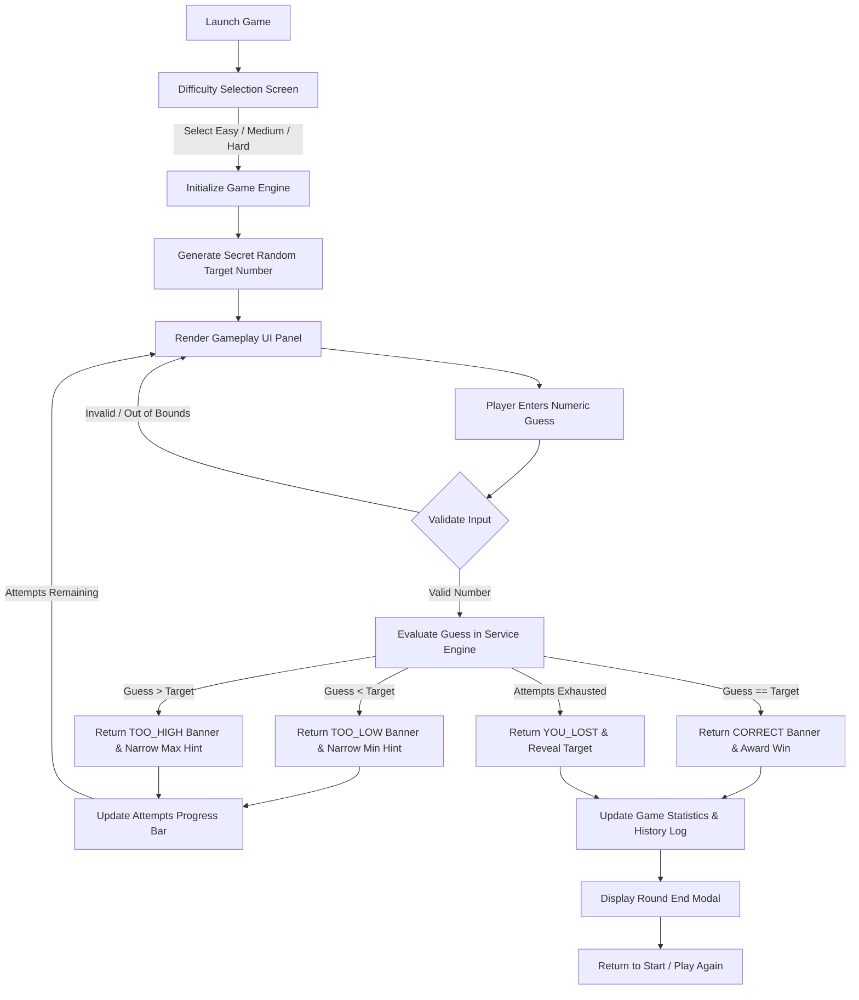

# Number Guessing Game

A modern, high-contrast, fully functional Java Swing desktop game where players attempt to guess a randomly generated hidden number within customizable difficulty levels and limited attempt bounds.

---

## 🎯 Objective

The objective of the **Number Guessing Game** is to deliver an engaging, interactive desktop gaming experience that tests player logic and deduction. By selecting varying difficulty levels (Easy, Medium, Hard), players guess a target number generated by the system while receiving real-time visual feedback, dynamic hint range narrowing, and visual attempt progress tracking.

---

## ✨ Features

- **🖥️ Modern High-Contrast Swing UI**:
  - Built with FlatLaf dark theme (`FlatDarkLaf`).
  - Adaptive maximized desktop window (`JFrame.MAXIMIZED_BOTH`) using responsive Swing layout managers (`BorderLayout`, `GridBagLayout`, `GridLayout`).
- **🎲 Dynamic Target Generation**:
  - Automatically generates a secret target number using `java.util.Random` within active difficulty range bounds at the start of every round.
- **🎚️ Multiple Difficulty Levels**:
  - **Easy**: Target Range `1 – 50`, `10` Attempts
  - **Medium**: Target Range `1 – 100`, `7` Attempts
  - **Hard**: Target Range `1 – 200`, `5` Attempts
- **💡 Real-Time Feedback & Hint Engine**:
  - Displays instant visual outcome banners: `"Too High!"`, `"Too Low!"`, `"Correct!"`, or `"You Lost!"`.
  - Dynamic hint range indicator (`minHint – maxHint`) that dynamically narrows after every valid guess to assist player strategy.
- **📊 Visual Attempts Progress Tracking**:
  - Progress bar (`JProgressBar`) updating after every valid guess with color shifts:
    - 🟩 **Green**: High remaining attempts.
    - 🟨 **Yellow**: Moderate remaining attempts.
    - 🟥 **Red**: Critical / Final attempt.
- **🛡️ Strict Input Validation**:
  - Rejects empty strings, alphabetic characters, symbols, decimals, and out-of-bounds numbers without consuming attempt chances.
- **📈 Score & History Dashboard**:
  - Tracks total rounds played, rounds won, rounds lost, and win percentage (`Win Rate %`).
  - Interactive `JTable` rendering round-by-round logs (Difficulty, Target Number, Guesses Used, Result).
  - Dedicated **"Reset Score"** feature with a safety confirmation modal.

---

## 🛠️ Technologies Used

- **Programming Language**: Java 21 (LTS)
- **GUI Framework**: Java Swing
- **Look and Feel**: [FlatLaf](https://www.formdev.com/flatlaf/) 3.4.1 (FlatDarkLaf)
- **Build System**: Apache Maven 3.8+
- **Testing Framework**: JUnit 5 (JUnit Jupiter 5.10.2)

---

## 🚀 How to Run

### Prerequisites
- **Java Development Kit (JDK)**: Version 21 or higher
- **Apache Maven**: Version 3.8+

### Step-by-Step Instructions

#### 1. Run Automated Unit Tests
```powershell
mvn clean test
```

#### 2. Build Executable Package
```powershell
mvn clean package
```

#### 3. Run Application via Maven
```powershell
mvn exec:java
```

#### 4. Or Run Standalone Executable JAR
```powershell
java -jar target/number-guessing-game-1.0.0-jar-with-dependencies.jar
```

---

## 📁 Project Structure

```text
Java-Task2-NumberGuessingGame/
├── pom.xml
├── src/
│   ├── main/
│   │   └── java/
│   │       └── com/
│   │           └── oasis/
│   │               └── guessinggame/
│   │                   ├── Main.java                        # Entry point setting L&F and EDT launcher
│   │                   ├── model/                           # Game domain & data models
│   │                   │   ├── Difficulty.java              # Enum defining EASY, MEDIUM, HARD parameters
│   │                   │   ├── GuessResult.java             # Enum for TOO_HIGH, TOO_LOW, CORRECT, OUT_OF_BOUNDS
│   │                   │   ├── GuessFeedback.java           # Transfer model for guess outcomes & hints
│   │                   │   ├── GameRound.java               # Active round data tracker
│   │                   │   └── GameStatistics.java          # Score metrics, win rates & round history
│   │                   ├── service/                         # Core game engine logic
│   │                   │   └── NumberGuessingGame.java      # State machine decoupled from UI
│   │                   ├── ui/                              # Swing GUI components
│   │                   │   ├── MainFrame.java               # Top-level maximized window frame
│   │                   │   ├── StartPanel.java              # Welcome & difficulty selection cards
│   │                   │   ├── GamePanel.java               # Main active gameplay panel
│   │                   │   └── StatisticsPanel.java         # Dashboard showing metrics & history JTable
│   │                   └── util/                            # Design tokens & constants
│   │                       └── GameConstants.java           # Color palette, fonts & style rules
│   └── test/
│       └── java/
│           └── com/
│               └── oasis/
│                   └── guessinggame/
│                       └── NumberGuessingGameTest.java      # Automated JUnit 5 unit tests
└── target/
    └── number-guessing-game-1.0.0-jar-with-dependencies.jar
```

### Class Responsibility Summary

| Package | Class | Purpose |
| :--- | :--- | :--- |
| `com.oasis.guessinggame.model` | `Difficulty` | Enum defining difficulty parameters (range bounds, max attempts). |
| `com.oasis.guessinggame.model` | `GuessResult` | Enum representing guess evaluation outcomes. |
| `com.oasis.guessinggame.model` | `GuessFeedback` | Data transfer model encapsulating attempt state and hints. |
| `com.oasis.guessinggame.model` | `GameRound` | Model tracking individual active or completed round data. |
| `com.oasis.guessinggame.model` | `GameStatistics` | Aggregate score metrics, win rates, and history log store. |
| `com.oasis.guessinggame.service` | `NumberGuessingGame` | Core game engine decoupled from UI layer. |
| `com.oasis.guessinggame.util` | `GameConstants` | High-contrast design tokens, color palette, and typography fonts. |
| `com.oasis.guessinggame.ui` | `StartPanel` | Welcome screen panel with difficulty selection cards. |
| `com.oasis.guessinggame.ui` | `GamePanel` | Main active gameplay UI with guess input field and result banner. |
| `com.oasis.guessinggame.ui` | `StatisticsPanel` | Dashboard displaying performance cards and round history table. |
| `com.oasis.guessinggame.ui` | `MainFrame` | Top-level maximized window container. |
| `com.oasis.guessinggame` | `Main` | Entry point setting look-and-feel and launching GUI on EDT. |

---

## 🖼️ Screenshots

*Below are visual descriptions of the user interface screens:*

1. **Start Screen & Difficulty Selection**:
   - High-contrast welcome cards allowing single-click selection of **Easy** (1-50), **Medium** (1-100), or **Hard** (1-200).
   - `[ Screenshot Placeholder: docs/screenshots/start_screen.png ]`

2. **Main Gameplay Screen**:
   - Guess input box, real-time feedback banner (`"Too Low! Guess higher."`), narrowing hint range (`Range: 42 – 100`), and color-shifting attempts progress bar.
   - `[ Screenshot Placeholder: docs/screenshots/gameplay_screen.png ]`

3. **Round Victory / Loss Banner**:
   - Modal popup announcing round victory with score points earned or revealing secret target on loss.
   - `[ Screenshot Placeholder: docs/screenshots/victory_modal.png ]`

4. **Statistics & Score History Dashboard**:
   - Summary cards displaying Total Rounds, Wins, Losses, and Win Rate %, alongside a detailed `JTable` round history.
   - `[ Screenshot Placeholder: docs/screenshots/statistics_panel.png ]`

---

## ⚙️ How the Application Works



### Step-by-Step User Workflow:

1. **Launch & Theme Setup**:
   - `Main.java` registers FlatLaf dark theme, creates `MainFrame`, and shows `StartPanel`.
2. **Difficulty Selection**:
   - Candidate selects difficulty mode (**Easy**: 1-50, **Medium**: 1-100, **Hard**: 1-200).
3. **Round Initialization**:
   - `NumberGuessingGame.java` engine resets attempts counter, calculates max attempts allowed (10, 7, or 5), and generates secret target number via `java.util.Random`.
4. **Gameplay & Evaluation**:
   - Candidate types guess into `JTextField` and presses **Enter** or clicks **Submit Guess**.
   - Input is validated by `ValidationUtil`.
   - `NumberGuessingGame.evaluateGuess()` returns a `GuessFeedback` record containing result status, current hint range (`minHint` to `maxHint`), and remaining attempt percentage.
5. **Feedback & Progress Bar Update**:
   - Screen displays outcome banner ("Too High!" or "Too Low!").
   - Progress bar updates visually (shifts from Green to Yellow to Red as attempts decrease).
6. **Round Completion & Statistics Logging**:
   - When player guesses correctly or runs out of attempts, round data (`GameRound`) is recorded into `GameStatistics`.
   - Score dashboard updates win rate percentage and adds row entry into the `JTable` history log.

---

## 🔮 Future Improvements

- **💾 High Score Persistence**: Save round history and high scores locally using JSON or SQLite.
- **🔊 Sound & Audio Feedback**: Add sound effects for correct guesses, incorrect attempts, and victory animations.
- **⏱️ Timed Speed Run Mode**: Option to add a 60-second countdown timer for rapid-fire guessing.
- **🌐 Global Leaderboard**: Connect to a cloud API server for competitive global player rankings.
