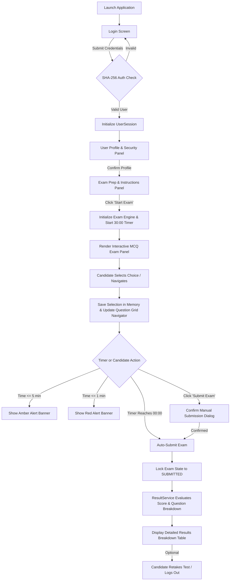

# Online Examination System 📝

A modern, high-performance desktop-based **Online Examination System** built with **Java 21**, **Java Swing**, and **FlatLaf Look & Feel**.

---

## 🎯 Objective

The objective of the **Online Examination System** is to provide an end-to-end computer-based testing platform for candidate assessment. It streamlines candidate login, profile maintenance, interactive exam administration with real-time countdown timers, submission safety guards, and instant detailed score evaluations with question breakdown analytics.

---

## ✨ Features

- **🔒 Secure Authentication & Session Management**:
  - Encrypted password validation using SHA-256 hashing.
  - Decoupled `UserRepository`, `AuthenticationService`, and active `UserSession` model.
  - Automatic session clearing upon candidate logout.
- **👤 User Profile & Security Panel**:
  - Displays candidate username and editable display name.
  - Optional password update panel with confirmation checks.
  - Remembers profile completion state to streamline exam access.
- **📋 Examination Overview & Instructions**:
  - Pre-exam prep panel detailing test title, total question count (20 MCQ questions), and duration (30 minutes).
  - Assessment countdown timer initializes **only** when candidate clicks **Start Exam**.
- **⏱️ Interactive MCQ Exam Interface**:
  - Renders **1 question at a time** with 4 options using `JRadioButton` and `ButtonGroup`.
  - **Live Progress Bar**: `JProgressBar` tracking percentage completed (`((currentIdx + 1) * 100) / total`).
  - **Live Answered Counter**: Real-time counter (`Answered: X / N`) updating immediately upon option selection.
  - **Real-Time Countdown Timer**: `javax.swing.Timer` (30:00 ➔ 00:00) with visual warning alerts:
    - 🟧 **Amber Warning Banner** when time $\le 5$ minutes.
    - 🟥 **Red Critical Alert** when time $\le 1$ minute.
  - **Question Navigator Grid**: Quick-jump buttons (1 to N) with color-coded status indicators (Active, Answered, Unanswered).
  - **Answer Persistence**: Preserves selections across `Next`, `Previous`, and grid jump navigation.
- **🛡️ Submission Safety & State Machine**:
  - Guarded exam state lifecycle (`NOT_STARTED` ➔ `IN_PROGRESS` ➔ `SUBMITTED` ➔ `ABANDONED`) preventing duplicate submissions.
  - **Auto-Submission**: Automatically submits test without prompts when timer reaches `00:00`.
  - **Manual Submission**: Confirmation dialog (`YES` / `NO`) requiring candidate confirmation.
  - **Window Close Protection**: Intercepts `WINDOW_CLOSING` events during active exams to prevent accidental exit.
- **📊 Comprehensive Results Breakdown**:
  - Metric summary card: Final Score (`X out of Y`), Correct, Incorrect, Unanswered count, and Time Elapsed.
  - **Dynamic Grade Feedback**: Performance banners (*"Excellent Performance!"*, *"Good Performance!"*, etc.).
  - **Question Breakdown Table**: Read-only `JTable` rendering Question #, Question Text, Selected Answer, Correct Answer, and Result Status.
  - **Retake Exam Option**: Option for candidates to cleanly reset choices and restart test.

---

## 🛠️ Technologies Used

- **Programming Language**: Java 21 (LTS)
- **GUI Framework**: Java Swing
- **Look and Feel**: [FlatLaf](https://www.formdev.com/flatlaf/) 3.4.1 (FlatDarkLaf)
- **Build System**: Apache Maven 3.9+
- **Testing Framework**: JUnit 5 (JUnit Jupiter 5.10.2)

---

## 🚀 How to Run

### Prerequisites
- **Java Development Kit (JDK)**: Version 21 or higher
- **Apache Maven**: Version 3.8+

### Pre-Configured Test Accounts

| Username | Password | Display Name | Role |
|---|---|---|---|
| `student1` | `password123` | Candidate Student | Standard Student |
| `admin` | `admin123` | System Administrator | Administrator |
| `candidate` | `pass123` | Alex Johnson | Candidate |

---

### Step-by-Step Instructions

#### 1. Clone Repository & Navigate
```bash
git clone https://github.com/your-username/Java-Task4-OnlineExaminationSystem.git
cd Java-Task4-OnlineExaminationSystem
```

#### 2. Run Automated Unit Tests
```bash
mvn clean test
```

#### 3. Build Executable Package
```bash
mvn clean package
```

#### 4. Run Application via Maven Exec Plugin
```bash
mvn exec:java
```

#### 5. Or Run Standalone Executable JAR
```bash
java -jar target/online-examination-system-1.0.0-jar-with-dependencies.jar
```

---

## 📁 Project Structure

```text
Java-Task4-OnlineExaminationSystem/
├── pom.xml
├── src/
│   ├── main/
│   │   └── java/
│   │       └── com/
│   │           └── oasis/
│   │               └── exam/
│   │                   ├── Main.java                        # Application entry point
│   │                   ├── model/                           # Domain entities & state enums
│   │                   │   ├── User.java
│   │                   │   ├── Question.java
│   │                   │   ├── ExamState.java               # NOT_STARTED, IN_PROGRESS, SUBMITTED, ABANDONED
│   │                   │   ├── UserSession.java             # Logged-in candidate session & profile state
│   │                   │   ├── QuestionResult.java
│   │                   │   └── ExamResult.java
│   │                   ├── repository/                      # Data access & question banks
│   │                   │   ├── UserRepository.java          # SHA-256 password hashing & candidate store
│   │                   │   └── QuestionRepository.java      # 20 Java & CS MCQ question bank
│   │                   ├── service/                         # Business logic services
│   │                   │   ├── AuthenticationService.java
│   │                   │   ├── ExamService.java             # Countdown timer, navigation & submission lock
│   │                   │   └── ResultService.java           # Score calculation & result analysis
│   │                   ├── ui/                              # Swing UI views & CardLayout components
│   │                   │   ├── ThemeManager.java            # FlatDarkLaf design tokens & styling
│   │                   │   ├── MainFrame.java               # Top-level window & view router
│   │                   │   ├── LoginPanel.java
│   │                   │   ├── ProfilePanel.java
│   │                   │   ├── InstructionsPanel.java
│   │                   │   ├── ExamPanel.java
│   │                   │   └── ResultPanel.java
│   │                   └── util/                            # Formatting & validation utilities
│   │                       ├── ValidationUtil.java
│   │                       └── TimeUtil.java
│   └── test/
│       └── java/
│           └── com/
│               └── oasis/
│                   └── exam/                                # Automated JUnit 5 unit test suite
│                       ├── AuthenticationServiceTest.java
│                       ├── ExamServiceTest.java
│                       ├── QuestionRepositoryTest.java
│                       └── ResultServiceTest.java
└── target/
    └── online-examination-system-1.0.0-jar-with-dependencies.jar
```

---

## 🖼️ Screenshots

*Below are visual representations of the application views:*

1. **Login Screen**:
   - Modern candidate login card with SHA-256 password hashing validation.
   - `[ Screenshot Placeholder: docs/screenshots/login_panel.png ]`

2. **User Profile & Security Panel**:
   - Display name editing and security password change UI.
   - `[ Screenshot Placeholder: docs/screenshots/profile_panel.png ]`

3. **Pre-Exam Prep & Instructions Screen**:
   - Test overview displaying 20 questions, 30-minute time limit, scoring rules, and **Start Exam** button.
   - `[ Screenshot Placeholder: docs/screenshots/instructions_panel.png ]`

4. **Live MCQ Exam Panel & Navigator Grid**:
   - Active question display with radio button choices, real-time timer with warning banners, live progress bar, and color-coded question grid navigator.
   - `[ Screenshot Placeholder: docs/screenshots/exam_panel.png ]`

5. **Detailed Performance Breakdown Table**:
   - Results dashboard rendering final score, correct/incorrect count, dynamic grade banner, and question-by-question breakdown table.
   - `[ Screenshot Placeholder: docs/screenshots/results_panel.png ]`

---

## ⚙️ How the Application Works



### Step-by-Step User Workflow:

1. **Authentication**:
   - Candidate logs in using pre-configured test credentials (`student1` / `password123`). `AuthenticationService` hashes the input with SHA-256 and verifies it against `UserRepository`.
2. **Profile & Security Check**:
   - Candidate reviews profile details, optionally updates display name or password, and advances to the instructions screen.
3. **Pre-Exam Briefing**:
   - Instructions screen details total questions (20 MCQ), test duration (30 mins), and marking system.
   - Timer does not begin until the candidate clicks **Start Exam**.
4. **Taking the Examination**:
   - Exam panel opens displaying Question 1 of 20 with 4 radio button options.
   - Candidate selects an option, updating the live **Answered: X / 20** counter and marking the question button **Green** in the navigator grid.
   - Candidate moves between questions via **Next**, **Previous**, or by clicking directly on numbers in the **Question Grid Navigator**.
   - As time ticks down, visual banners warn candidates at 5 minutes (Amber) and 1 minute (Red).
5. **Submission Safety Guard**:
   - Test can be submitted manually by clicking **Submit Exam** and confirming the modal dialog.
   - If time expires (00:00), `ExamService` automatically triggers submission, locking the exam state to `SUBMITTED`.
6. **Detailed Score Analysis**:
   - `ResultService` calculates total correct, incorrect, and unanswered questions, total score, and time taken.
   - Candidate reviews performance metrics, dynamic evaluation badge, and question breakdown `JTable`.
   - Clicking **Retake Exam** resets state for another attempt, or clicking **Logout** safely ends the session.

---

## 🔮 Future Improvements

- **🗄️ Database Integration**: Connect to MySQL/PostgreSQL for persistent question banks and historical student score storage.
- **🛠️ Instructor Admin Dashboard**: GUI panel allowing teachers to add, edit, or delete MCQ questions and adjust test durations dynamically.
- **👁️ Anti-Cheating Monitoring**: Detect window tab focus loss or application minimization and issue auto-proctored warnings.
- **📜 Downloadable Completion Certificates**: Generate printable PDF completion certificates with score badges for passing candidates.
